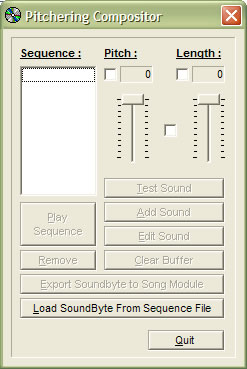



## Pitchering Compositor

### Description

I created this project because I was curious about mixing API programming with classes, collections and all that good stuff. This application will let you create sound by using the beep API. It allows you to control the pitch and length oth the sound. It also adds each created sound to a collection so you can add them as bits of a song.

You can save your creation to file and load your creations from file.

This is not for begginers but it is commented for ease in understanding. I hope you like it and if you do, please vote for me!!!
 
### More Info
 
Knowledge of Windows API is helpful. Should understand concepts of OOP, classes, collections, collections of clesses, memory data acces, file access, etc.

             |
---                |---
**Submitted On**   |2002-07-28 03:06:12
**By**             |[Ramon E\. Tristani](https://github.com/Planet-Source-Code/PSCIndex/blob/master/ByAuthor/ramon-e-tristani.md)
**Level**          |Advanced
**User Rating**    |4.6 (23 globes from 5 users)
**Compatibility**  |VB 6\.0
**Category**       |[Complete Applications](https://github.com/Planet-Source-Code/PSCIndex/blob/master/ByCategory/complete-applications__1-27.md)
**World**          |[Visual Basic](https://github.com/Planet-Source-Code/PSCIndex/blob/master/ByWorld/visual-basic.md)
**Archive File**   |[Pitchering1115747282002\.zip](https://github.com/Planet-Source-Code/ramon-e-tristani-pitchering-compositor__1-37329/archive/master.zip)

### API Declarations

This code is presented to you by me, Ramon Tristani, its author. If you use this code in any way, remember to give credit to the author, ME. I enjoy sharing what I humbly know, but do enjoy receiving credit for my hard work. Thanks.

